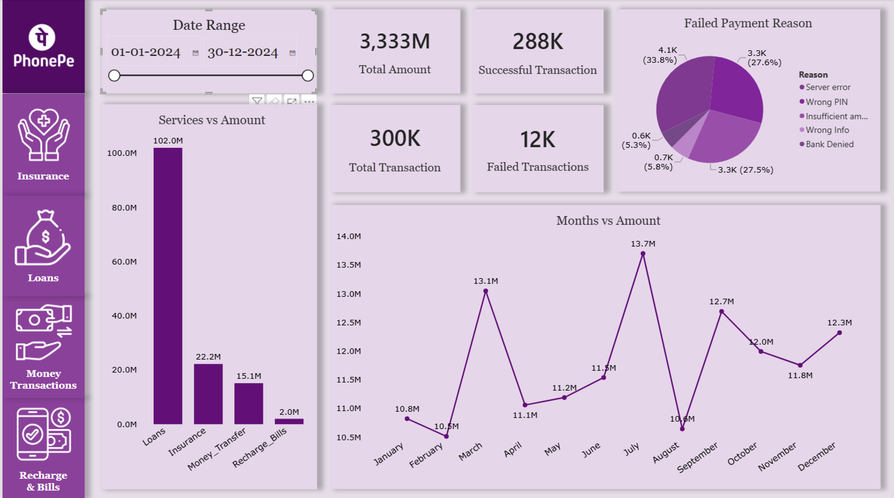

# PhonePe Failed Transaction Analysis | Power BI

## Project Overview

This Power BI practice project analyses failed digital-payment transactions using an AI-generated synthetic dataset designed around PhonePe-style payment services.

The dashboard examines payment outcomes, failed-payment value, failure reasons, service/category contribution, and monthly trends across Insurance, Loans and related financial services, Money Transfers, and Recharge & Bills.

> **Disclaimer:** This is a portfolio practice project built with synthetic data. It is not affiliated with PhonePe and does not represent real customer, transaction, or business data.

## Table of Contents

- [Project Overview](#project-overview)
- [Dashboard Preview](#-dashboard-preview)
- [Business Problem](#business-problem)
- [Dashboard Features](#dashboard-features)
- [Dashboard Pages](#dashboard-pages)
  - [Home](#home)
  - [Insurance](#insurance)
  - [Loans and Related Financial Services](#loans-and-related-financial-services)
  - [Money Transactions](#money-transactions)
  - [Recharge & Bills](#recharge--bills)
- [Key Insights](#key-insights)
- [Recommendations](#recommendations)
- [Data Preparation](#data-preparation)
- [Data Model](#data-model)
- [Tools Used](#tools-used)
- [Repository Structure](#repository-structure)
- [Author](#author)

## Dashboard Preview



## Business Problem

Digital-payment platforms process large volumes of transactions across multiple services. Even with a high success rate, failed transactions can affect customer trust, potential revenue, support workload, and service adoption.

The goal of this dashboard is to answer:

- What proportion of transactions fail?
- Which services contribute the highest failed-payment value?
- What are the most common reasons for payment failure?
- Which categories and months need the most operational attention?
- What actions could reduce failed payments and improve user experience?

## Dashboard Features

- Five report pages: Home, Insurance, Loans, Money Transactions, and Recharge & Bills
- Date-range slicer on each page
- KPI cards for transaction amount and transaction volume
- Payment-status visuals
- Failed-payment reason analysis
- Monthly failed-payment amount trends
- Service/category-level failed-payment comparisons
- Navigation buttons in the left-side menu for moving between pages

## Dashboard Pages

### Home

The Home page provides an overall view of failed transactions across services.

- Successful transactions: 288K
- Total transactions: 300K
- Failed transactions: 12K
- Overall failure rate: approximately 4%

It also shows:

- Failed-payment reasons across all services
- Failed-payment amount by service
- Monthly failed-payment amount trend

Key observations:

- Server Error is the largest failure reason: 4.1K failures (33.8%).
- Wrong PIN and Insufficient Amount are close behind at approximately 3.3K failures each.
- Loans have the highest failed-payment amount at 102M.
- The highest failed-payment month is July at 13.7M.

### Insurance

The Insurance page analyses Bike, Car, Term Life, and Health insurance payments.

- Total transaction amount: 512.9M
- Successful transactions: 47.9K (95.8%)
- Failed transactions: 2.1K (4.2%)
- Highest failed-payment category: Bike insurance at 5.9M
- Highest failed-payment month: October at 2.1M

Failure reasons are almost evenly split between Wrong PIN, Server Error, and Insufficient Amount.

### Loans and Related Financial Services

This page analyses the practice-dataset categories Gold Loan, Auto Loan, Mutual Funds, and Credit Score.

- Total transaction amount: 2,532.5M
- Successful transactions: 48.0K (95.9%)
- Failed transactions: 2.0K (4.1%)
- Highest failed-payment category: Gold Loan at 27M
- Highest failed-payment month: July at 10.3M

Wrong Information, Server Error, and Bank Denied are the primary failure reasons and have a similar contribution.

### Money Transactions

This page analyses transfer activity by method.

- Successful money transferred: 362.95M
- Total transactions: 150,000
- Successful transactions: 143.96K (95.98%)
- Failed transactions: 6.04K (4.02%)
- Highest failed-payment amount by transfer type: To UPI ID at 4.02M
- Highest failed-payment month: March at 1.39M

The main failure reasons are Insufficient Amount, Server Error, and Wrong PIN.

### Recharge & Bills

This page analyses Mobile Recharge, Electricity, DTH, and Cable TV payments.

- Total transaction amount: 50.69M
- Successful transactions: 48.1K (96.2%)
- Failed transactions: 1.9K (3.8%)
- Highest failed-payment category: Mobile at 516K
- Highest failed-payment month: July at 198K

The failure reasons—Server Error, Wrong PIN, and Insufficient Amount—are closely distributed.

## Key Insights

- The overall transaction failure rate is approximately 4%, while failed-payment value is heavily concentrated in Loans.
- Loans contribute 102M in failed-payment amount, making them the highest-priority service for operational investigation.
- Within Loans, Gold Loan has the highest failed-payment amount at 27M.
- Server Error, incorrect PIN entry, insufficient amount, incorrect information, and bank declines are recurring failure drivers.
- Failed-payment amounts peak in July for the overall dashboard, Loans, and Recharge & Bills.
- Bike Insurance, Gold Loan, UPI-ID transfers, and Mobile Recharge have the highest failed amount within their respective services.

## Recommendations

- Prioritise failure reduction in loan-related services, especially Gold Loan payments.
- Monitor and investigate failed-payment spikes in July and other service-specific peak months.
- Improve server monitoring, retry handling, and payment-gateway reliability.
- Add clearer user guidance for PIN, balance, and payment-information validation.
- Use proactive alerts when failure rate or failed-payment amount crosses a defined threshold.
- Review UPI-ID transfer flows because they have the highest failed value among transfer types.

## Data Preparation

The dataset was AI-generated and was already largely clean.

The main preparation step was standardising decimal monetary values to whole-number amounts for this practice dataset.

> Note: Real UPI payments can support decimal INR/paise amounts. Therefore, this should be described as a synthetic-data standardisation choice—not as a limitation of UPI or banking applications.

## Data Model

The Power BI model contains these tables:

- `All_Transactions`
- `All_Users`
- `Insurance`
- `Loans`
- `Money_Transfer`
- `Recharge_Bills`

The report uses fields such as Date, Transaction ID, Amount, Premium, Loan Amount, Payment Status, Failure Reason, and service/category type.

## Tools Used

- Microsoft Power BI
- Power Query
- Data Modelling
- Interactive Visualisations
- AI-generated dataset

## Repository Structure

```text
PhonePe-Failed-Transaction-Analysis/
│
├── PhonePe Case Study.pbix
├── README.md
└── screenshots/
    ├── home-page.png
    ├── insurance-page.png
    ├── loans-page.png
    ├── money-transactions-page.png
    └── recharge-bills-page.png
```

## Author

**Ashish Gautam**  
Data Analyst | Power BI | Excel | SQL

**Email**: ashishgautam323@gmail.com

**LinkedIn**: www.linkedin.com/in/theashishgautam
